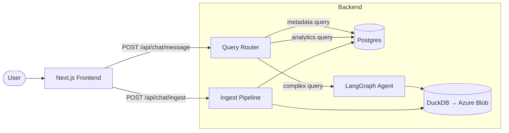
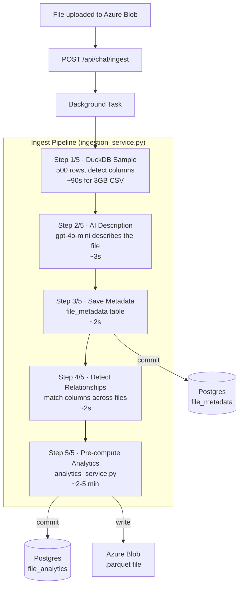
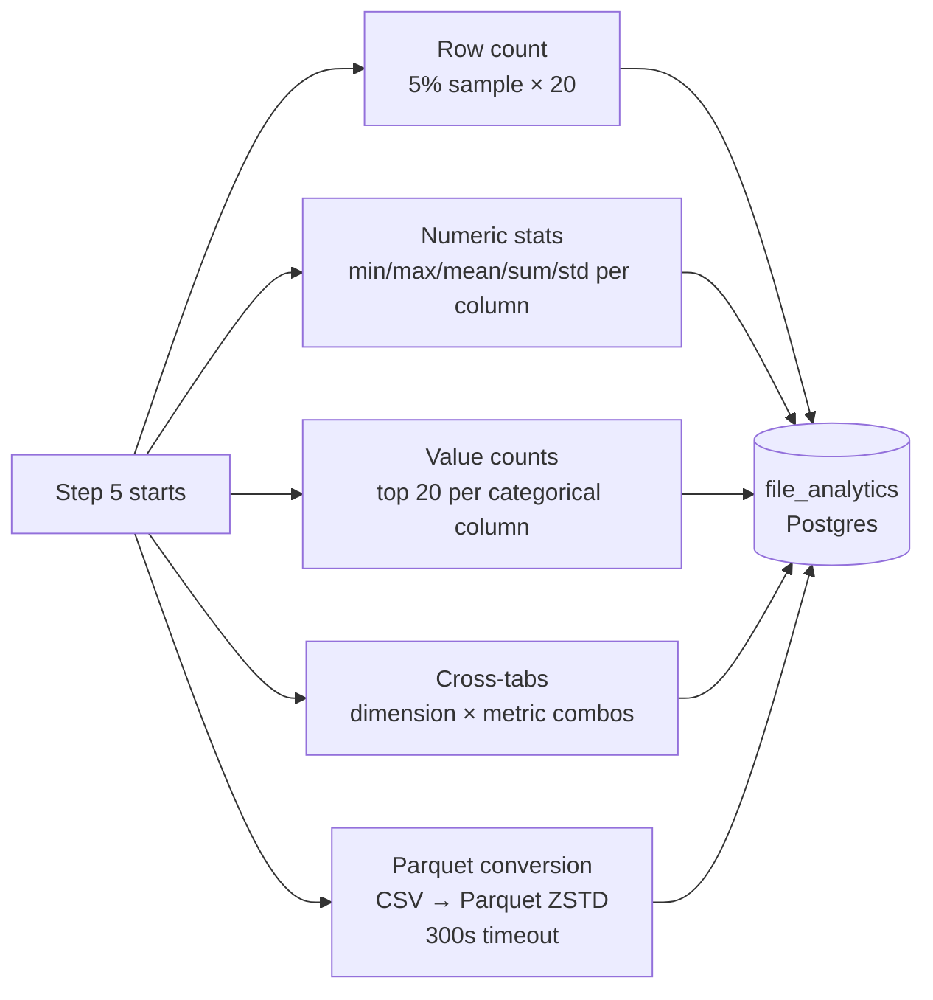
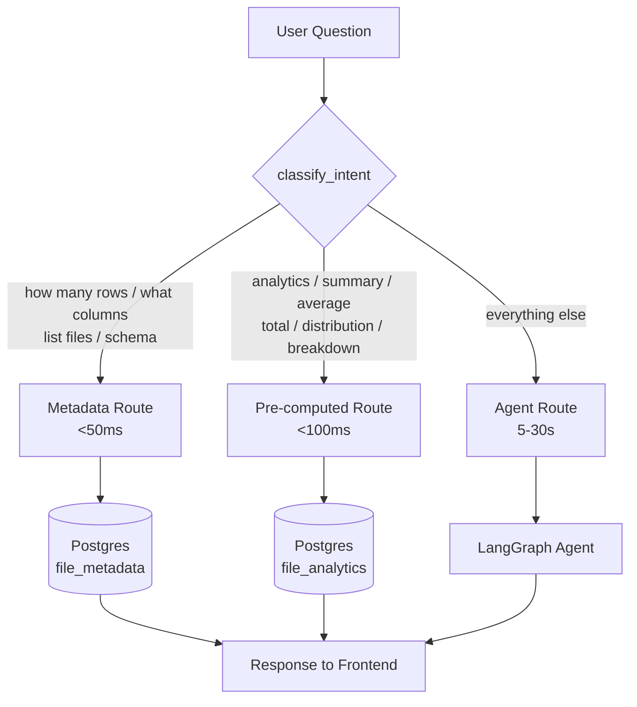
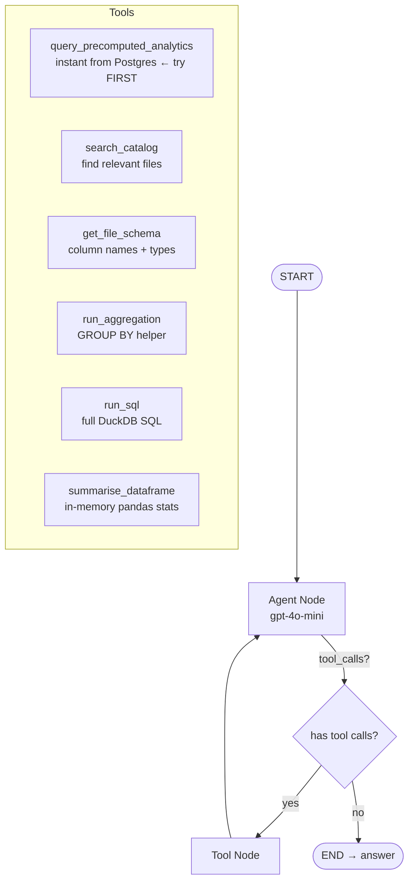
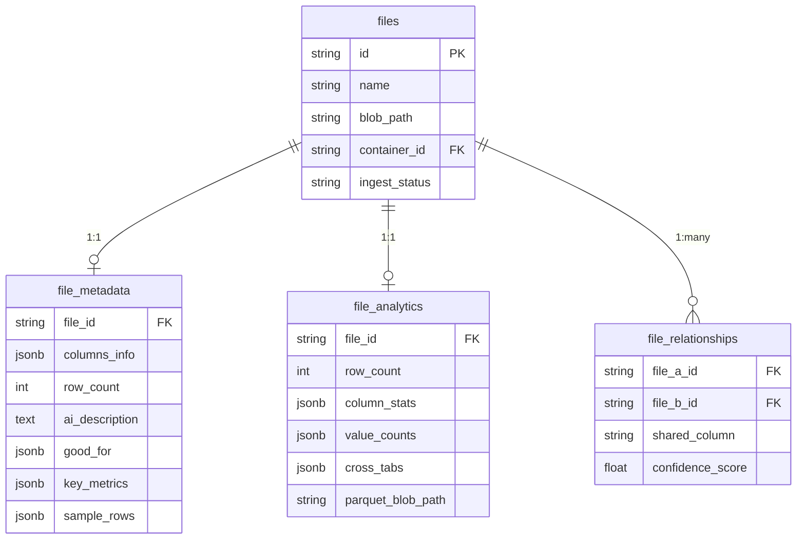

# G-CHAT Architecture

## Stack

| Layer | Technology |
|-------|-----------|
| Frontend | Next.js 14 (App Router) |
| Backend | FastAPI + Python 3.12 |
| LLM | Azure OpenAI `gpt-4o-mini` |
| Agent | LangGraph 1.1 + LangChain |
| Analytics DB | DuckDB (reads Azure Blob directly) |
| Metadata DB | Neon PostgreSQL (asyncpg) |
| Storage | Azure Blob Storage |

---

## High-Level Flow



---

## 1. Ingest Pipeline

Triggered manually by admin. Runs as a FastAPI **background task** — non-blocking.



### What Step 5 computes

All queries run on a **5% BERNOULLI sample** — fast even on 3GB files.



---

## 2. Query Router

Every chat message is classified **without an LLM call** — pure keyword matching, instant.



---

## 3. LangGraph Agent

Only invoked when the query router can't answer from pre-computed data.  
**MAX_TOOL_CALLS = 6**, hard 30s timeout per DuckDB query.



### Tool priority order

```
1. query_precomputed_analytics  ← no DuckDB, instant
2. search_catalog               ← no DuckDB, catalog only
3. get_file_schema              ← no DuckDB, catalog only
4. run_aggregation              ← DuckDB, GROUP BY, 30s timeout
5. run_sql                      ← DuckDB, full SQL, 30s timeout
6. summarise_dataframe          ← in-memory pandas, no DuckDB
```

---

## 4. Data Storage



---

## 5. Module Layout

```
server/app/
├── agent/                      ← LangGraph pipeline
│   ├── graph.py                ← StateGraph builder + run_agent_query()
│   ├── state.py                ← AgentState TypedDict
│   ├── llm.py                  ← Azure OpenAI singleton
│   └── tools/
│       ├── analytics.py        ← query_precomputed_analytics
│       ├── catalog.py          ← search_catalog, get_file_schema
│       ├── sql.py              ← run_sql, run_aggregation
│       └── stats.py            ← summarise_dataframe
│
├── services/
│   ├── ingestion_service.py    ← 5-step ingest pipeline
│   ├── analytics_service.py    ← pre-compute stats (Step 5)
│   └── query_router.py         ← intent classifier + fast-path handlers
│
├── core/
│   ├── duckdb_client.py        ← DuckDB + Azure Blob, 30s timeout
│   ├── database.py             ← SQLAlchemy async engine (pool_recycle=300)
│   └── config.py               ← env vars
│
├── models/
│   ├── file_metadata.py
│   ├── file_analytics.py       ← pre-computed stats table
│   └── file_relationship.py
│
└── api/
    └── chat.py                 ← POST /message (router) + POST /ingest
```

---

## 6. Why Parquet?

```
3GB CSV over Azure Blob
├── Full scan:  ~7 min per query   (reads every byte)
└── Parquet:    ~15 sec per query  (columnar, reads only needed columns)

Storage:  3GB CSV → ~400MB Parquet (ZSTD compression)
Cost:     ~$78/month at 10 queries/day (CSV) → ~$2/month (Parquet)
```

Once Parquet is written at ingest time, the agent's `run_aggregation` and `run_sql` tools automatically use `read_parquet()` instead of `read_csv_auto()`.
